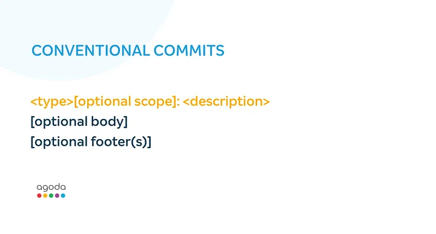
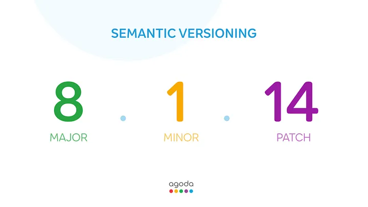
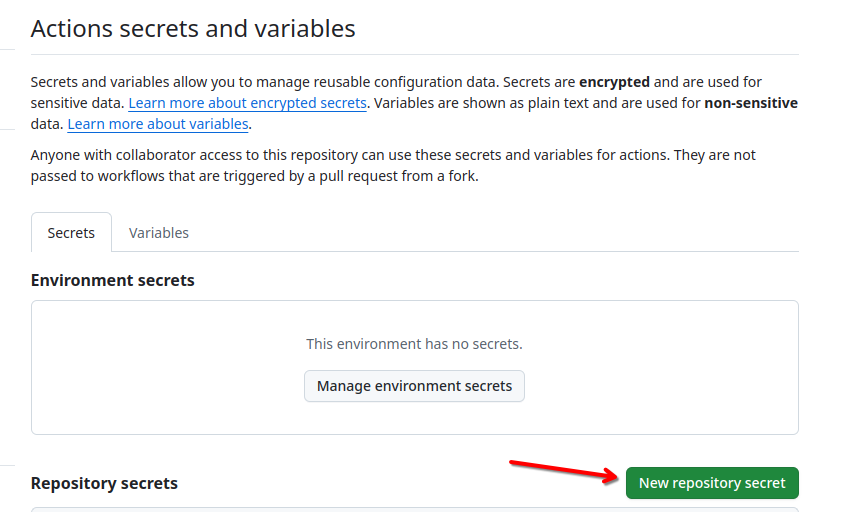
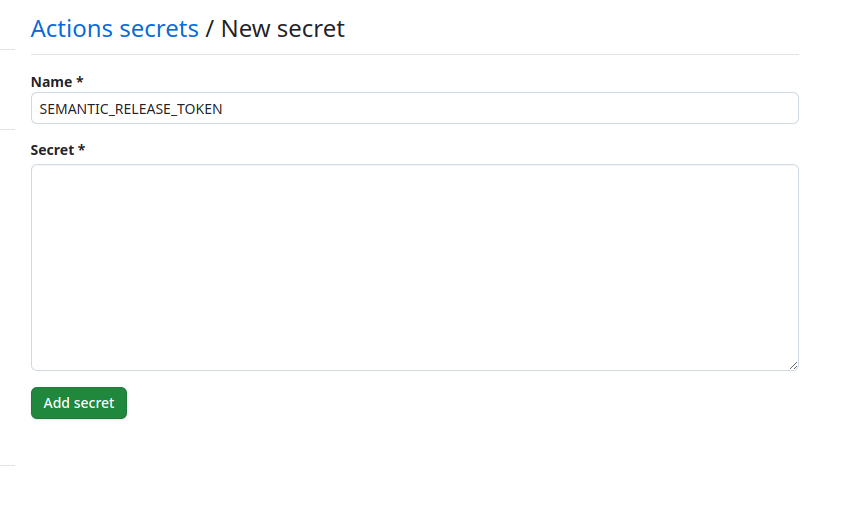
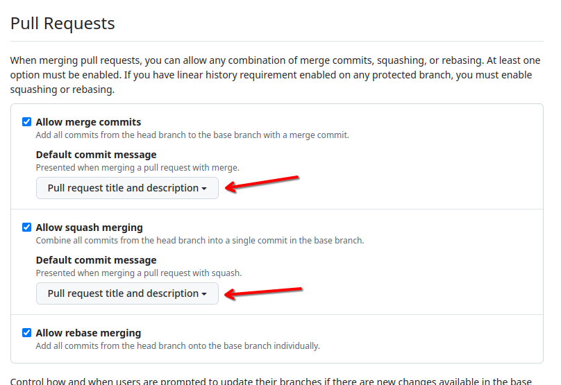

# semantic-release

## Conventional Commits

> The Conventional Commits specification is a lightweight convention
> on top of commit messages. It provides an easy set of rules for creating
> an explicit commit history; which makes it easier to write automated
> tools on top of.

Conventional commit is a specification, a set of rules that have to be
followed when writing commit messages. It is heavily inspired by Angular
commit guidelines, and follows this structure

Only `type` and `description` are mandatory, rest everything is optional.
The value of `type` is important and needs to be only one of the following

- feat: A new feature
- fix: A bug fix
- docs: Documentation only changes
- style: Changes that do not affect the meaning of the code (white-space,
  formatting, missing semi-colons, etc)
- refactor: A code change that neither fixes a bug nor adds a feature
- perf: A code change that improves performance
- test: Adding missing or correcting existing tests
- chore: Changes to the build process or auxiliary tools and libraries
  such as documentation generation

This makes your commit messages readable not only to humans but also to bots,
you can now automate releases ([SemVer](https://semver.org/)), automate changelogs,
and more.

## Semantic Versioning

Semantic Versioning (also called SemVer) is a specification,
a simple set of rules that dictates how version numbers of your
projects are assigned and incremented.

As per this specification, any version number should be complying with
this structure — `MAJOR.MINOR.PATCH` where,

1. MAJOR version is incremented when you make any breaking change
2. MINOR version is incremented when you add a new feature/functionality
3. PATCH version is incremented when you make bug fixes

## Setup

### Create Github [Personal Access Token](https://docs.github.com/en/authentication/keeping-your-account-and-data-secure/managing-your-personal-access-tokens)

Token permissions:

`Read Access`

- Variables
- Environments
- Metadata (default)
- Secrets

`Read/Write Access`

- Contents
- Commit statuses
- Issue
- Pull Requests
- Workflows

### Secrets

Add secret `SEMANTIC_RELEASE_TOKEN` with the value of the token created
in the previous step

`Settings -> Secrets and variables -> New repository secret`

### Default merge commit message

Settings -> Pull Requests -> Default commit message -> Pull request title
and description

optional: change squash merging commit message
